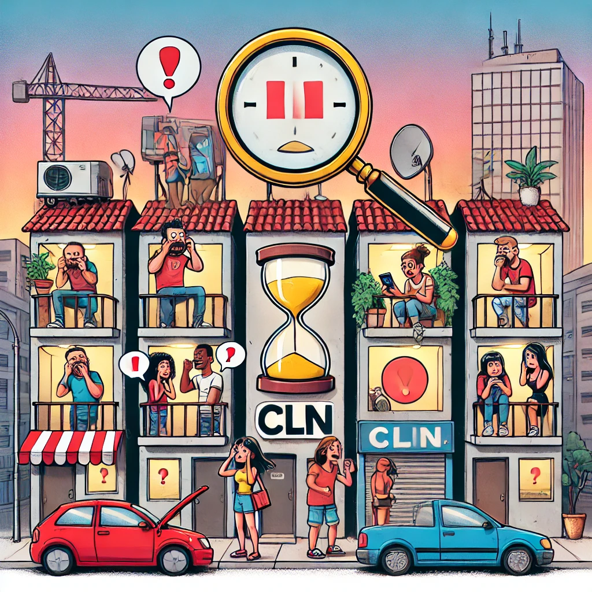

# HomeScrapDesperation

**HomeScrapDesperation** is a personal project aimed at simplifying the challenging process of finding an affordable apartment in **CLN**, a commercial area in Brasília. With the cost of living in Brasília being high, finding a well-located, affordable apartment in good condition is a real struggle. This scraper helps keep track of new listings to improve my chances of securing a place.

## What It Does

- Scrapes new apartment listings from DF Imóveis daily, focusing on CLN.
- Retrieves apartment descriptions, image URLs, listing links, and Cresci numbers (real estate registration).

## Why This Matters

Brasília is an expensive city to live in, and the housing market moves fast. Having missed out on opportunities before, this tool helps me stay ahead, giving me a better chance to act quickly when a suitable apartment is listed.

## Future Plans

- Automate daily scraping and add custom alerts for listings that meet my criteria.

## Project Logo

This logo was designed with the help of [ChatGPT](https://openai.com), supporting the creation of HomeScrapDesperation.
